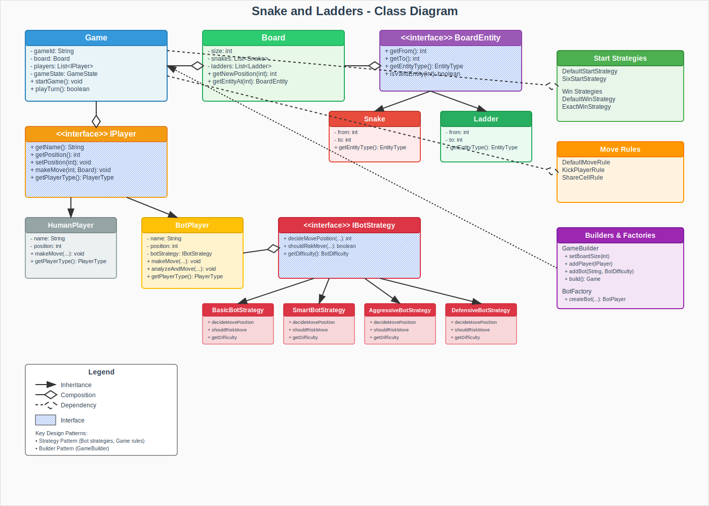

# Snake and Ladders Game

A full-stack implementation of the classic Snake and Ladders board game with intelligent bot players, configurable rules, and a modern web interface.

## 🎯 Overview

This project consists of two main components:

- **Backend** (`snakes-ladders-backend/`): Java Spring Boot REST API with intelligent bot AI and flexible game rules
- **Frontend** (`snakes-ladders-frontend/`): React-based interactive web interface

## 🚀 Quick Start

### Prerequisites
- Java 17+ (for backend)
- Node.js 16+ (for frontend)
- Maven (for backend build)

### Running the Full Stack

1. **Start the Backend**
   ```bash
   cd snakes-ladders-backend
   ./mvnw spring-boot:run
   ```
   Backend will be available at `http://localhost:8080`

2. **Start the Frontend**
   ```bash
   cd snakes-ladders-frontend
   npm install
   npm start
   ```
   Frontend will be available at `http://localhost:3000`

3. **Play the Game**
   - Open your browser to `http://localhost:3000`
   - Click "Quick Start" for a fast game setup
   - Or configure custom games with multiple players and rule variants

## 🎮 Features

### Game Features
- **Classic Gameplay**: Traditional Snake and Ladders with modern enhancements
- **Configurable Board**: Customizable board sizes and entity placements
- **Multiple Players**: Support for human and bot players in the same game
- **Smart AI Bots**: Four difficulty levels with distinct strategies
- **Rule Variants**: Different start conditions, win conditions, and movement rules

### Technical Features
- **REST API**: Complete game management with RESTful endpoints
- **Real-time Updates**: Automatic game state synchronization
- **Responsive Design**: Works seamlessly on desktop and mobile
- **Comprehensive Testing**: Unit tests for core game logic
- **Clean Architecture**: SOLID principles and design patterns

## 🏗️ Architecture Overview

```
┌─────────────────────────────────────────────────────────────────┐
│                          Frontend (React)                       │
│  ┌─────────────┐  ┌─────────────┐  ┌─────────────┐             │
│  │  GameBoard  │  │GameControls │  │ PlayerList  │             │
│  └─────────────┘  └─────────────┘  └─────────────┘             │
│         │                 │                 │                  │
│         └─────────────────┼─────────────────┘                  │
│                           │                                     │
│                    ┌─────────────┐                             │
│                    │  Game API   │                             │
│                    │  Service    │                             │
│                    └─────────────┘                             │
└─────────────────────────┼───────────────────────────────────────┘
                          │ HTTP/REST
┌─────────────────────────┼───────────────────────────────────────┐
│                  Backend (Spring Boot)                         │
│                    ┌─────────────┐                             │
│                    │    REST     │                             │
│                    │ Controller  │                             │
│                    └─────────────┘                             │
│                           │                                     │
│                    ┌─────────────┐                             │
│                    │    Game     │                             │
│                    │   Service   │                             │
│                    └─────────────┘                             │
│                           │                                     │
│      ┌─────────────┬──────────────┬──────────────┐             │
│      │    Game     │    Board     │   Players    │             │
│      │   Model     │    Model     │   Models     │             │
│      └─────────────┴──────────────┴──────────────┘             │
└─────────────────────────────────────────────────────────────────┘
```

## 🎨 Low-Level Design (LLD) Implementation

### Class Diagram



### Design Patterns Applied

#### 1. **Strategy Pattern**
- **Game Rules**: Configurable start, win, and move strategies
- **Bot Intelligence**: Multiple AI difficulty levels with distinct behaviors
- **Flexibility**: Easy to add new rule variants without modifying existing code

#### 2. **Builder Pattern**
- **Game Creation**: `GameBuilder` with fluent interface for easy configuration
- **Default Values**: Sensible defaults with customization options
- **Type Safety**: Compile-time validation of game configurations

#### 3. **Factory Pattern**
- **Bot Creation**: `BotFactory` for creating AI players with specific difficulties
- **Abstraction**: Hides bot instantiation complexity from client code

#### 4. **Template Method Pattern**
- **Entity Interface**: `BoardEntity` with common validation behavior
- **Polymorphism**: Snakes and Ladders share common interface with specialized implementations

### SOLID Principles

| Principle | Implementation |
|-----------|----------------|
| **Single Responsibility** | Each class has one clear purpose (Game manages state, Board manages layout, Players handle actions) |
| **Open/Closed** | New strategies and bot types can be added without modifying existing code |
| **Liskov Substitution** | All strategy implementations and player types are fully interchangeable |
| **Interface Segregation** | Small, focused interfaces (`IStartStrategy`, `IWinStrategy`, `IBotStrategy`) |
| **Dependency Inversion** | High-level modules depend on abstractions, not concrete implementations |

### Key Components

#### Core Game System
- **Game**: Central game coordinator managing state and turns
- **Board**: Manages board layout, snakes, ladders, and player positions
- **Players**: Interface-based hierarchy supporting humans and multiple bot types
- **Entities**: Snakes and Ladders with common behavioral interface

#### Strategy System
- **Start Strategies**: Control when players can begin (any roll vs. need six)
- **Win Strategies**: Define victory conditions (exact landing vs. crossing finish)
- **Move Rules**: Handle player interactions (kick others, share cells, etc.)
- **Bot Strategies**: AI decision-making algorithms for different difficulty levels

#### Bot Intelligence Levels

| Difficulty | Strategy Description |
|------------|----------------------|
| **EASY** | Basic random movement, no strategic thinking |
| **MEDIUM** | Analyzes board entities, basic risk assessment |
| **HARD** | Aggressive play, actively seeks ladders, competitive moves |
| **EXPERT** | Defensive play, careful risk management, long-term planning |

## 📋 Requirements Addressed

### Functional Requirements
- ✅ **Classic Gameplay**: Traditional Snake and Ladders rules implementation
- ✅ **Multi-Player Support**: Human and bot players in the same game
- ✅ **Configurable Rules**: Start strategies, win conditions, movement rules
- ✅ **Bot AI**: Multiple difficulty levels with distinct behaviors
- ✅ **Game Management**: Create, start, play, and complete games
- ✅ **State Persistence**: Maintain game state throughout sessions

### Non-Functional Requirements
- ✅ **Scalability**: Clean architecture supports easy feature additions
- ✅ **Maintainability**: SOLID principles and design patterns ensure code quality
- ✅ **Testability**: Comprehensive unit test coverage for core logic
- ✅ **Usability**: Intuitive web interface with real-time updates
- ✅ **Performance**: Efficient game state management and API responses
- ✅ **Reliability**: Error handling and input validation throughout

### Technical Requirements
- ✅ **REST API**: Complete game management endpoints
- ✅ **Modern Frontend**: React-based responsive web interface
- ✅ **Real-time Updates**: Automatic synchronization of game state
- ✅ **Cross-platform**: Web-based solution works on all modern browsers
- ✅ **Documentation**: Comprehensive README files and code documentation

## 🧪 Testing

### Backend Tests
```bash
cd snakes-ladders-backend
./mvnw test
```

### Frontend Tests
```bash
cd snakes-ladders-frontend
npm test
```

### Test Coverage
- **Backend**: Unit tests for game logic, strategies, and bot behaviors
- **Frontend**: Component tests for UI interactions and API integration

## 📚 API Documentation

### Game Management
- `POST /api/games` - Create a new game
- `GET /api/games/{gameId}` - Get current game state
- `POST /api/games/{gameId}/start` - Start the game
- `POST /api/games/{gameId}/move` - Make a move (roll dice)
- `POST /api/games/quick` - Create a quick game (1 human vs 1 bot)

### Example API Usage
```bash
# Create a quick game
curl -X POST http://localhost:8080/api/games/quick

# Start the game
curl -X POST http://localhost:8080/api/games/{gameId}/start

# Make moves
curl -X POST http://localhost:8080/api/games/{gameId}/move
```

## 🛠️ Technologies Used

### Backend
- **Java 17**: Modern Java features and performance
- **Spring Boot 3.2.0**: Enterprise-grade application framework
- **Maven**: Dependency management and build automation
- **JUnit**: Comprehensive testing framework

### Frontend
- **React 18**: Modern UI library with hooks
- **Axios**: HTTP client for API communication
- **CSS Grid/Flexbox**: Modern layout techniques
- **Responsive Design**: Mobile-first approach

## 🚧 Future Enhancements

### Gameplay Features
- Custom board configurations and themes
- Tournament mode with multiple games
- Game history and replay functionality
- Advanced statistics and player achievements

### Technical Improvements
- WebSocket integration for real-time multiplayer
- Persistent game storage with database
- Progressive Web App (PWA) capabilities
- Advanced AI with machine learning

### User Experience
- Sound effects and animations
- Custom player avatars and themes
- Social features and leaderboards
- Offline gameplay support

## 📁 Project Structure

```
SnakeAndLadders/
├── README.md                          # This file
├── snakes-ladders-backend/            # Java Spring Boot backend
│   ├── README.md                      # Backend-specific documentation
│   ├── class-diagram.svg              # Architecture diagram
│   ├── pom.xml                        # Maven configuration
│   └── src/                           # Source code
│       ├── main/java/                 # Application code
│       └── test/java/                 # Unit tests
└── snakes-ladders-frontend/           # React frontend
    ├── README.md                      # Frontend-specific documentation
    ├── package.json                   # Node.js dependencies
    ├── public/                        # Static assets
    └── src/                           # React components
        ├── components/                # UI components
        ├── services/                  # API integration
        └── utils/                     # Utility functions
```

## 🤝 Contributing

1. Fork the repository
2. Create a feature branch
3. Make your changes
4. Add tests for new functionality
5. Ensure all tests pass
6. Submit a pull request

## 📄 License

This project is available for educational and personal use.

---

**Ready to play?** Start both services and visit `http://localhost:3000` to begin your Snake and Ladders adventure! 🎲🐍🪜