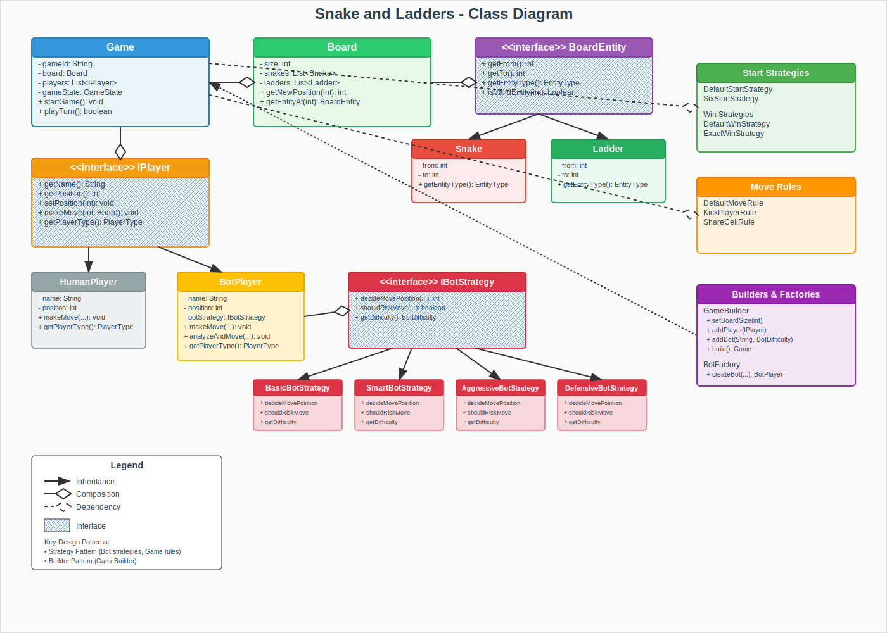

# Snake and Ladders Backend

A Java Spring Boot backend implementation of the classic Snake and Ladders board game with configurable rules and intelligent bot players.

## Features

- **Configurable Game Rules**: Start strategies, win conditions, and move rules
- **Smart Bot AI**: Multiple difficulty levels with different strategies
- **Entity Abstraction**: Common interface for Snakes and Ladders
- **Strategy Pattern**: Flexible rule configuration at runtime
- **Builder Pattern**: Easy game creation with sensible defaults
- **REST API**: Complete game management endpoints

## Architecture

### Class Diagram



The diagram above shows the complete architecture of the Snake and Ladders backend system, highlighting:

- **Core Game Classes**: Game, Board, and entity management
- **Player Hierarchy**: Interface-based design with Human and Bot implementations
- **Strategy Patterns**: Flexible rule configuration for different game variants
- **Bot Intelligence**: Multiple AI strategies from Basic to Expert level
- **Builder Pattern**: Easy game configuration and creation

## Design Patterns Used

### 1. Strategy Pattern
- **Start Strategies**: `DefaultStartStrategy`, `SixStartStrategy`
- **Win Strategies**: `DefaultWinStrategy`, `ExactWinStrategy`
- **Move Rules**: `DefaultMoveRule`, `KickPlayerRule`, `ShareCellRule`
- **Bot Strategies**: `BasicBotStrategy`, `SmartBotStrategy`, `AggressiveBotStrategy`, `DefensiveBotStrategy`

### 2. Builder Pattern
- `GameBuilder` class for flexible game construction
- Fluent interface for easy configuration
- Default values for quick setup

### 3. Factory Pattern
- `BotFactory` for creating bot players with different difficulty levels
- Encapsulates bot creation logic

### 4. Template Method Pattern
- `BoardEntity` interface with default validation method
- Common behavior with customizable parts

## SOLID Principles

### Single Responsibility Principle (SRP)
- Each class has a single, well-defined responsibility
- `Game` manages game state, `Board` manages board logic, `Player` handles player actions

### Open/Closed Principle (OCP)
- New strategies can be added without modifying existing code
- New bot difficulties through strategy implementations

### Liskov Substitution Principle (LSP)
- All strategy implementations can be used interchangeably
- `BotPlayer` and `HumanPlayer` are fully substitutable

### Interface Segregation Principle (ISP)
- Small, focused interfaces (`IStartStrategy`, `IWinStrategy`, etc.)
- Clients depend only on methods they use

### Dependency Inversion Principle (DIP)
- High-level modules depend on abstractions
- `Game` depends on strategy interfaces, not concrete implementations

## API Endpoints

### Games
- `POST /api/games` - Create a new game
- `GET /api/games/{gameId}` - Get game state
- `POST /api/games/{gameId}/start` - Start the game
- `POST /api/games/{gameId}/move` - Make a move (roll dice)
- `POST /api/games/quick` - Create a quick game (1 human vs 1 bot)

## Quick Start

1. **Clone the repository**
   ```bash
   git clone <repository-url>
   cd snakes-ladders-backend
   ```

2. **Build and run**
   ```bash
   ./mvnw clean install
   ./mvnw spring-boot:run
   ```

3. **Test the API**
   ```bash
   # Create a quick game
   curl -X POST http://localhost:8080/api/games/quick
   
   # Start the game
   curl -X POST http://localhost:8080/api/games/{gameId}/start
   
   # Make moves
   curl -X POST http://localhost:8080/api/games/{gameId}/move
   ```

## Game Configuration Examples

### Basic Game
```java
Game game = GameBuilder.createDefault().build();
```

### Custom Game
```java
Game game = new GameBuilder()
    .setBoardSize(10)
    .addHumanPlayer("Alice")
    .addBot("SmartBot", BotDifficulty.HARD)
    .setStartStrategy(new SixStartStrategy())
    .setWinStrategy(new ExactWinStrategy())
    .setMoveRule(new KickPlayerRule())
    .build();
```

## Bot AI Levels

- **EASY**: Basic movement, no strategy
- **MEDIUM**: Analyzes snakes and ladders, basic risk assessment
- **HARD**: Aggressive play, seeks ladders, competitive moves
- **EXPERT**: Defensive play, careful risk management

## Technologies Used

- Java 17
- Spring Boot 3.2.0
- Maven
- JUnit (for testing)

## Future Enhancements

- Persistent game storage
- Real-time multiplayer with WebSockets
- Custom board configurations
- Advanced bot AI with machine learning
- Game history and statistics