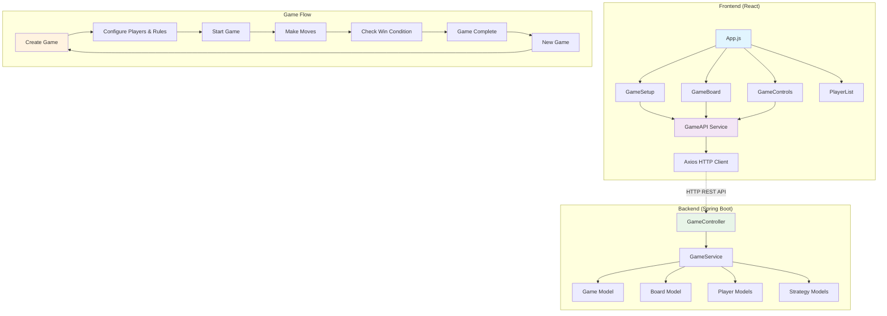
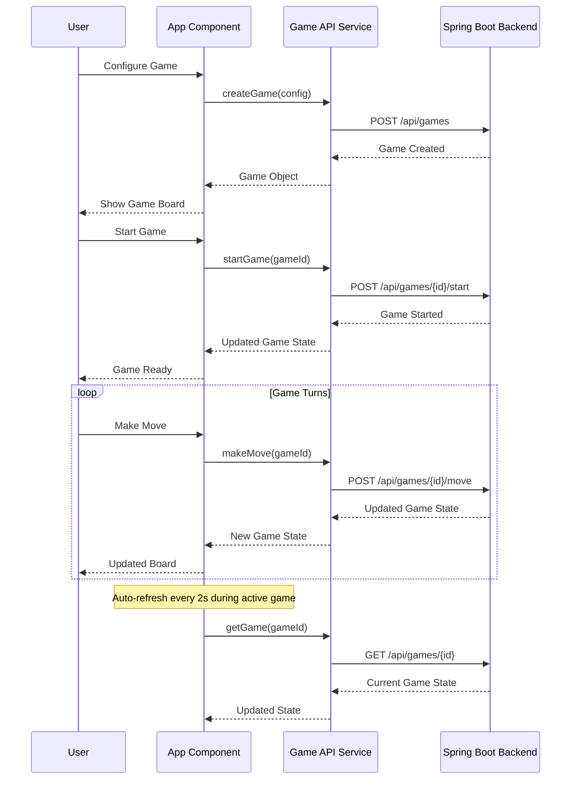

# Snake and Ladders Frontend

A React-based frontend for the Snake and Ladders game, providing an interactive game board and intuitive user interface.

## Features

- **Interactive Game Board**: Visual 10x10 (configurable) board with snakes and ladders
- **Real-time Game State**: Automatic updates during gameplay
- **Player Management**: Support for multiple human and bot players
- **Game Configuration**: Customizable rules and player setup
- **Responsive Design**: Works on desktop and mobile devices
- **Visual Feedback**: Clear indicators for current player, winners, and game state

## Architecture

### Component Structure

```
src/
├── components/
│   ├── GameBoard/
│   │   ├── GameBoard.js          # Main board component
│   │   └── GameBoard.css         # Board styling
│   ├── GameControls/
│   │   ├── GameControls.js       # Game control buttons and status
│   │   └── GameControls.css      # Control styling
│   ├── Player/
│   │   ├── PlayerList.js         # Player information display
│   │   └── PlayerList.css        # Player styling
│   ├── GameSetup/
│   │   ├── GameSetup.js          # Game configuration form
│   │   └── GameSetup.css         # Setup form styling
│   └── Common/                   # Shared components
├── services/
│   └── gameApi.js               # API communication
├── hooks/                       # Custom React hooks
├── utils/                       # Utility functions
├── App.js                       # Main application component
├── App.css                      # Global styles
└── index.js                     # Application entry point
```

### System Architecture Diagram



### Data Flow



## Component Details

### GameBoard Component
- Renders the game board as a CSS Grid
- Displays snakes (🐍) and ladders (🪜) with destination indicators
- Shows player tokens with different colors
- Handles cell click events
- Responsive design for different screen sizes

### GameControls Component
- Game status display (waiting, in progress, finished)
- Control buttons (Start Game, Roll Dice & Move, New Game)
- Current player indicator
- Turn counter
- Game rules display

### PlayerList Component
- Displays all players with avatars
- Shows current player highlight
- Indicates winner
- Differentiates between human and bot players
- Shows bot difficulty levels

### GameSetup Component
- Quick start option (1 human vs 1 bot)
- Custom game configuration
- Player management (add/remove humans and bots)
- Rule selection (start strategy, win strategy, move rules)
- Form validation

## API Integration

### Game API Service (`gameApi.js`)

```javascript
export const gameApi = {
  createGame: async (gameConfig) => { /* POST /api/games */ },
  getGame: async (gameId) => { /* GET /api/games/{id} */ },
  startGame: async (gameId) => { /* POST /api/games/{id}/start */ },
  makeMove: async (gameId) => { /* POST /api/games/{id}/move */ },
  createQuickGame: async () => { /* POST /api/games/quick */ }
};
```

## Styling and Design

### CSS Architecture
- Component-scoped CSS files
- BEM-like naming conventions
- Responsive design with media queries
- CSS Grid for board layout
- Flexbox for component layouts

### Design System
- **Colors**: Blue primary, green success, red danger
- **Typography**: System fonts with clear hierarchy
- **Spacing**: Consistent 8px grid system
- **Shadows**: Subtle depth with box-shadows
- **Animations**: Smooth transitions for state changes

### Responsive Breakpoints
- Desktop: > 1024px (full layout)
- Tablet: 768px - 1024px (stacked layout)
- Mobile: < 768px (single column)

## State Management

### App State
```javascript
const [game, setGame] = useState(null);           // Current game data
const [isLoading, setIsLoading] = useState(false); // Loading state
const [error, setError] = useState(null);         // Error messages
const [showSetup, setShowSetup] = useState(true);  // Show setup form
```

### Game Object Structure
```javascript
{
  gameId: "uuid",
  gameState: "WAITING_TO_START" | "IN_PROGRESS" | "FINISHED",
  board: {
    size: 10,
    snakes: [{ from: 99, to: 54, entityType: "SNAKE" }],
    ladders: [{ from: 6, to: 25, entityType: "LADDER" }]
  },
  players: [{
    name: "Player 1",
    position: 42,
    playerType: "HUMAN" | "BOT",
    botDifficulty: "EASY" | "MEDIUM" | "HARD" | "EXPERT"
  }],
  currentPlayerIndex: 0,
  winner: null,
  turnCount: 15,
  startStrategyDescription: "Can start with any dice roll",
  winStrategyDescription: "Win by reaching or crossing the last cell",
  moveRuleDescription: "Standard movement rules"
}
```

## Features

### Real-time Updates
- Automatic game state refresh every 2 seconds during active games
- Immediate UI updates after user actions
- Error handling with user-friendly messages

### User Experience
- Loading states for all async operations
- Clear visual feedback for game state changes
- Intuitive game setup with validation
- Mobile-friendly responsive design

### Accessibility
- Semantic HTML structure
- Keyboard navigation support
- High contrast colors
- Screen reader friendly

## Quick Start

1. **Install dependencies**
   ```bash
   npm install
   ```

2. **Start development server**
   ```bash
   npm start
   ```

3. **Build for production**
   ```bash
   npm run build
   ```

4. **Run tests**
   ```bash
   npm test
   ```

## Configuration

### Environment Variables
- `REACT_APP_API_BASE_URL`: Backend API URL (default: http://localhost:8080/api)

### Backend Connection
The frontend expects the backend to be running on `http://localhost:8080`. Update the API base URL in `src/services/gameApi.js` if needed.

## Browser Support

- Chrome (latest)
- Firefox (latest)
- Safari (latest)
- Edge (latest)

## Technologies Used

- **React 18**: UI library
- **Axios**: HTTP client
- **CSS Grid/Flexbox**: Layout
- **CSS Custom Properties**: Theming
- **React Hooks**: State management

## Future Enhancements

- WebSocket integration for real-time multiplayer
- Game history and replay functionality
- Custom board themes and animations
- Sound effects and music
- Tournament mode
- Player statistics and achievements
- Offline mode with PWA capabilities